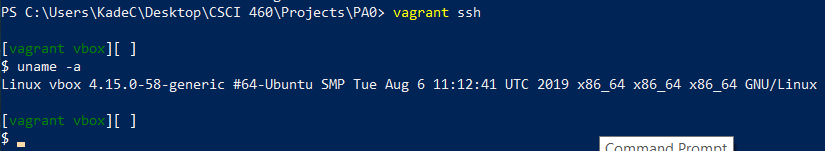

# CSCI-460
##### Top Level Repo for everything in Operating Systems
----
Initializing the ReadMe with information on PA0. Subject to change with the next Programming assignments. PA0 is about getting familiar with some of the products we will be using throughout the semester, including Git, Virtualbox/Vagrant and CMD line. This step is about getting familiar with some markdown and github. I kinda wanted to try alot of markdown formatting so this is not the most elegant solution but it's more fun.
- [x] Make a list
- [ ] Divide a Number by Zero
- [x] 

* [**Github Leaderboard**](https://github.com/EvanLi/Github-Ranking/blob/master/README.md)
  * This

* [**Clojure: Overtone**](https://github.com/overtone/overtone)

* [__Python: The F*ck__](https://github.com/nvbn/thefuck)
*  Everything about these readme pages are great. They are informative and clean. Not too much or too little. I obviously like using unordered lists as of now but i think getting tables involved would be cool and helpful. The embedded code formats will be useful in the future too.

### Task 3: Vagrant
It looks like running the uname -a command in the vagrant shell tells us what linux version is running on our VM.


### Task 4: Command Line
* __cd ~:__ takes you to your home directory
* __pwd:__ prints local directory
* __mkdir -p:__ Makes sub-directories. Creates the parent dir if it doesn't exist, goes down a level if the dir exists.
* __ln -s:__ creats a symbolic link to _mydir_
* __env | grep PATH:__ Pipes environment variable to grep and matches the PATH variable outputting something pretty.
* __curl -O:__ Downloads files from a remote, -O saves it to the current working directory.
* __cat info:__ concatenate allows us to display the contents of a file.
* __sudo lshw -html:__ gives us a detailed report on hardware. I'm assuming the html flag allows us to retrieve .html files.
* How to get more information w/out google? Man pages!
* I personally love the man pages because i am not super familiar with the unix cmd line so just typing man grep to get a quick overview of what/where/when and why to use it is super helpful and probably the most used tool for me so far.


### Task 5: Makefiles
* In program directory directory.
* It is important to use PHONY because we dont want to create anything new when we are removing files. PHONY does not create any file so it important to use it when you are cleaning up.
* I implemented a text scramble script from geeksforgeeks to take the the dressed.txt as input and then when i call make scramble it mixes all the word from dressed.txt making a new .txt file called dressedScrambled.txt.

### Task 6: Programming is C
```
  void freeAllNodes(struct listnode *head)
{
    struct listnode *current = head;
    struct listnode *next;
    while(current != NULL)
    {
        next = current -> next;
        freeNode(&current);
        current = next;
    };
    
}
```

* From the freeAllNodes function in stategame. 

### Task 7: Debugging in C Programs.
* 1: The address of head in the statesgame is ```0x7fffffffe3d0```
* You can call ```info local``` in the gdb debugger.

### Task 8: Valgrind
```
==22137== HEAP SUMMARY:
==22137==     in use at exit: 19 bytes in 2 blocks
==22137==   total heap usage: 3 allocs, 1 frees, 1,043 bytes allocated
==22137==
==22137== LEAK SUMMARY:
==22137==    definitely lost: 0 bytes in 0 blocks
==22137==    indirectly lost: 0 bytes in 0 blocks
==22137==      possibly lost: 0 bytes in 0 blocks
==22137==    still reachable: 19 bytes in 2 blocks
==22137==         suppressed: 0 bytes in 0 blocks
==22137== Rerun with --leak-check=full to see details of leaked memory
==22137==
==22137== For counts of detected and suppressed errors, rerun with: -v
==22137== ERROR SUMMARY: 0 errors from 0 contexts (suppressed: 0 from 0)
```
* This is the output from valgrind --tool=memcheck ./stategame

### Task 8: Git
* You're in my private repo. Hi.

