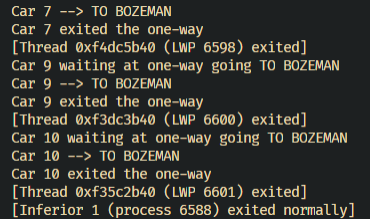

# Testing Stuff
## Kade Pitsch

I tested my program several times with goofy variables, i did some error catching in the main threaad catching command line arguments that would break things. I made it so you cant have more ```MAXCARS``` than ```NUMCARS``` just because that would not make sense, also handled if no arguments and too many arguments were entered. Then i ran my code with 100 threads and only  ```2 MAXCARS``` and it worked as expected so i think i caught most things.
## GDB output

```[Inferior 1 (process 6588) exited normally]```  
  

